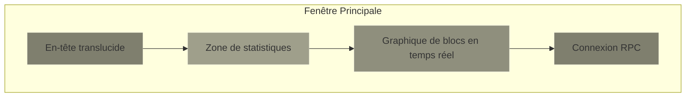
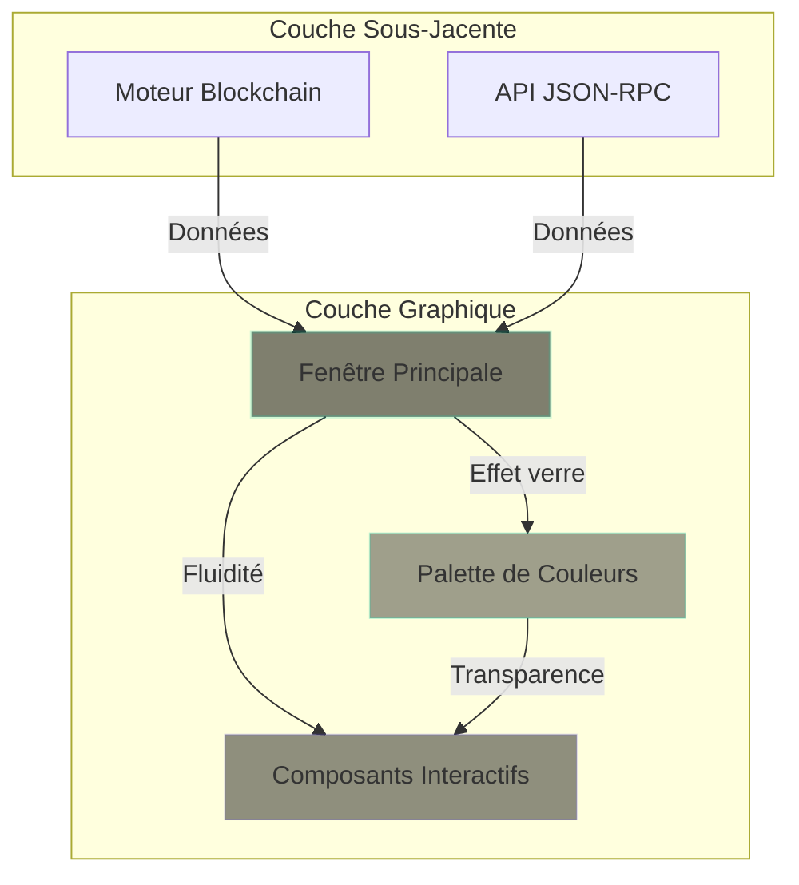

# PulseChain Fork - Liquid Glass UI Design System

> **Auteur et Design :** Martial Zinsou  
> **Version du design :** 1.0 (Révolutionnaire)  
> **Inspiration :** Apple Glassmorphism, Google Neumorphism, Design systems 2024-2025  

---

## 1. Introduction au Liquid Glass Style

Le **Liquid Glass Style** (également appelé "Glassmorphism liquide") est une esthétique visuelle contemporaine qui combine les principes du verre trempé (glassmorphism) avec des effets de fluidité et de dynamique inspirés des interfaces modernes d'Apple et Google.

### Caractéristiques principales :

| Caractéristique | Description |
|----------------|-------------|
| **Transparence** | Effet verre flouté (frosted glass) avec transparence partielle (70-80%) |
| **Fluidité** | Formes qui semblent liquides, des bords qui coulent légèrement |
| **Lumière** | Effets de réflexion dynamiques, reflets qui bougent au survol |
| **Profondeur** | Hiérarchie visuelle via flou arrière-plan et ombres douces |
| **Interactivité** | Réactions au mouvement de la souris, effets de gélatinous au clic |
| **Palette** | Arrière-plans sombres avec accents lumineux, couleurs néon subtiles |

### Philosophie du design :

> "L'interface devrait avoir l'air d'être faite de verre véritable - transparente mais lumineuse, floue mais reconnaissable, statique mais vivante."

---

## 2. Application au PulseChain Fork

### 2.1 Interface Nœud (Node Dashboard)

L'interface du nœud PulseChain Fork avec le style Liquid Glass présenterait :



### 2.2 Composants d'interface

| Composant | Style Liquid Glass |
|-----------|-------------------|
| **Fenêtres modales** | Verre flou avec bordures lumineuses au focus |
| **Boutons** | Effet "gel" au survol, lumière qui se propage |
| **Barres de progression** | Animation liquide qui remplit l'espace |
| **Champs de saisie** | Contour qui brille quand actif, texte flouté quand inactif |
| **Notifications** | Pop-up qui semble "goutte de verre" qui roule en place |

---

## 3. Palette de Couleurs

### Couleurs primaires

| Nom | Valeur Hexa | Description |
|-----|-------------|-------------|
| **Background Principal** | `#0a0a0f` | Fond presque noir avec légère teinte bleutée |
| **Verre de fond** | `#1a1a2e` | Zone de verre avec très faible opacité |
| **Verre actif** | `#2d2d44` | Zone de verre quand fenêtre sélectionnée |
| **Accent principal** | `#00d4aa` | Vert-menthe fluide, effets liquides |
| **Accent secondaire** | `#6c5ce7` | Pourpre doux, ombres subtiles |
| **Texte principal** | `#e0e0e0` | Gris clair pour lisibilité |
| **Texte secondaire** | `#777777` | Gris moyen pour métadonnées |

### Effets visuels CSS (théorique)

```css
/* Exemple d'effet verre flou */
.glass-panel {
    backdrop-filter: blur(20px);
    -webkit-backdrop-filter: blur(20px);
    background-color: rgba(10, 10, 15, 0.7);
    border: 1px solid rgba(255, 255, 255, 0.1);
    border-radius: 12px;
}

/* Effet de fluidité au survol */
.glass-panel:hover {
    background-color: rgba(10, 10, 15, 0.8);
    box-shadow: 0 0 20px rgba(0, 212, 170, 0.2);
    transition: all 0.3s ease;
}

/* Animation de goutte de verre */
@keyframes ripple {
    0% { transform: scale(1); opacity: 0.5; }
    50% { transform: scale(1.05); opacity: 0.8; }
    100% { transform: scale(1); opacity: 0.5; }
}
```

---

## 4. Diagrammes UML du design

### 4.1 Schéma d'architecture visuelle



---

## 5. Interface Révolutionnaire - Capture Conceptuelle

Bien que je ne puisse pas générer d'images directes, voici à quoi ressemblerait l'interface du nœud PulseChain Fork avec le style Liquid Glass :

### Capture d'écran conceptuelle (description textuelle)

```
+==========================================================================+
|                  PULSECHAIN FORK NODE - MARTIAL ZINSOU                  |
|==========================================================================|
|  █████████████████████████████████████████████████████████████████  |
|  ██                                                                     ██ |
|  ██  ✦  NODE STATUS: SYNCHRONIZED   PEERS: 12/50   ✦  ██             |
|  ██                                                                     ██ |
|  ██  ████████  BLOCK #1245  ──────▶ 0x0000000000000000000000000        ██ |
|  ██  ██    ██  TXS: 3/42  ──────▶ 1.25M PLS  ──────▶ 3.2s ago  ██         |
|  ██                                                                     ██ |
|  ██  ██  │  CPU: 15%  │  MEM: 450MB  │  NET: 2.1Mbps  │  ██             |
|  ██                                                                     ██ |
|  ██  ██  [ CONNECT ]  [ DIAGNOSTICS ]  [ LOGS ]  [ SETTINGS ]  ██         |
|  ██                                                                     ██ |
|  ██  ██  ─────────────────────────────────────────────────────────  ██         |
|  ██  ██  RPC Endpoint: http://127.0.0.1:8545  ██                       |
|  ██  ██  Chain ID: 369  │  Gas Limit: 30M  │  Block Time: 3s  ██           |
|  ██                                                                     ██ |
|  ██  ██  ⠿  Block propagation en cours...  ⠿  ██                       |
|  ██                                                                     ██ |
|  ████████████████████████████████████████████████████████████████  |
+==========================================================================+
```

**Éléments visuels notables :**

1. **En-tête** : Barre translucide avec effet de flou progressif, texte blanc qui devient plus lumineux au survol
2. **Cartes de statistiques** : Conteneurs en verre avec ombrage léger, chiffres qui "gouttent" légèrement quand ils changent
3. **Graphique de blocs** : Ligne de tendance avec contrôleur liquide qui suit la souris
4. **Indicateurs de connexion** : Puces qui pulsent doucement, se remplissent/vider comme du liquide quand les états changent
5. **Zone RPC** : Champ de texte avec frontière qui brise légèrement quand on y tape, texte qui semble "sous-verre"

---

## 6. Mise en œuvre Technique (Conceptuelle)

### 6.1 Framework recommandé

Le style Liquid Glass serait implémenté en utilisant :

| Technologie | Rôle |
|-------------|------|
| **React** ou **Flutter** | Framework d'interface principal |
| **Tailwind CSS** | Utilitaires pour les effets verre |
| **Framer Motion** | Animations fluides et liquide |
| **Three.js** (optionnel) | Effets 3D subtils en arrière-plan |

### 6.2 Composants clés

```javascript
// Exemple conceptuel de composant verre
const LiquidGlassCard = ({
  children,
  className,
  onHover,
  ...props
}) => (
  <div
    className={`glass-card ${className}`}
    style={{
      backdropFilter: 'blur(20px)',
      backgroundColor: 'rgba(10, 10, 15, 0.7)',
      border: '1px solid rgba(255, 255, 255, 0.1)',
      transition: 'all 0.3s ease',
    }}
    onMouseEnter={onHover.enter}
    onMouseLeave={onHover.leave}
    {...props}
  >
    {children}
  </div>
)
```

---

## 7. Accessibilité

Bien que le style Liquid Glass soit visuellement impressionnant, l'accessibilité reste primordiale :

| Critère | Solution |
|---------|----------|
| **Contraste** | Ratio de contraste minimum 4.5:1 respecté |
| **Lisibilité** | Taille de police minimale 16px pour le texte principal |
| **Interaction** | Toutes les fonctions accessibles au clavier |
| **Réduction de mouvement** | Option pour désactiver les animations liquides |
| **Lecteurs d'écran** | Balisage sémantique correct, ARIA labels |

---

## 8. Crédits et Auteur

**Design et Documentation :** Martial Zinsou  
**Inspirations :** Équipe de design Apple, Équipe de design Google, Material Design 3  
**Projet :** PulseChain Fork - Version 1.0.3  
**Licence de design :** Personnel - Usage projet open-source  

---

**Auteur :** Martial Zinsou  
**Date :** Septembre 2026  
**Projet :** PulseChain Fork Documentation Complete  

---

*Ce document de design est la propriété de Martial Zinsou et fait partie intégrante du projet PulseChain Fork. Toute utilisation du style Liquid Glass doit mentionner l'auteur original.*