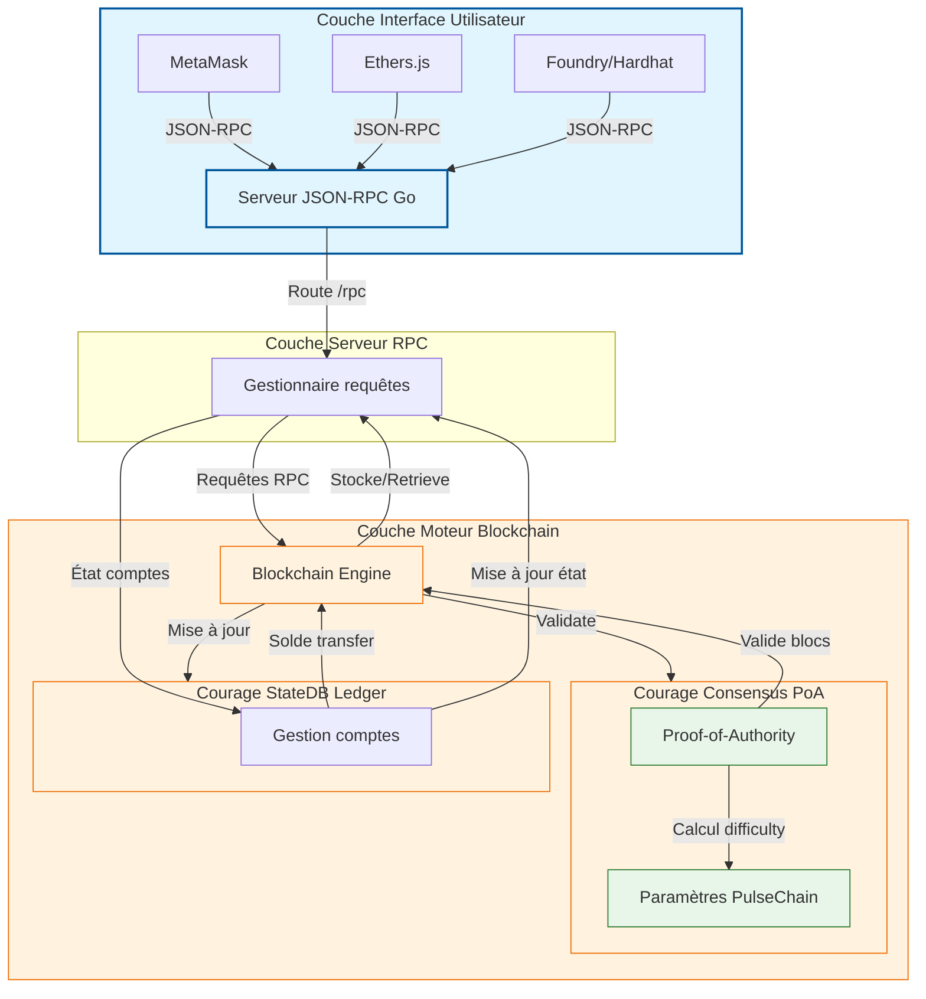
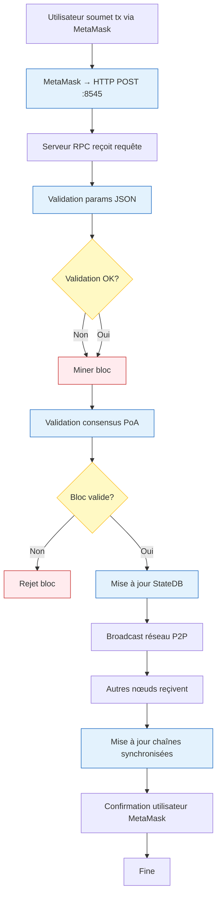

# PulseChain Fork - Architecture Système

> **Auteur :** Martial Zinsou  
> **Dépôt :** https://github.com/martialzinsou/pulsechain-fork  

## 1. Vue d'ensemble de l'architecture

Le projet **PulseChain Fork** adopte une architecture modulaire en couches, séparant clairement les responsabilités entre le moteur de blockchain, le consensus, le registre d'état et l'interface RPC. Cette conception facilite l'extension, le débogage et le déploiement.



---

## 2. Diagramme des composants (Component Diagram)

```mermaid
componentDiagram
    %% Composants principaux
    class PulseNode "PulseChain Fork Node"
    class RPCServer "Serveur JSON-RPC (internal/rpc/server.go)"
    class BlockEngine "Moteur Blockchain (internal/blockchain)"
    class Consensus "Consensus PoA (internal/consensus)"
    class StateMgr "StateDB Ledger (internal/ledger)"
    class Genesis "Configuration Génèse (genesis/)"

    %% Interfaces et dépendances
    PulseNode --> RPCServer : expose API
    PulseNode --> BlockEngine : gérer blocs
    PulseNode --> Consensus : valider blocs
    PulseNode --> StateMgr : état comptes
    PulseNode --> Genesis : paramètres initial

    %% Flux de données
    RPCServer <|-- BlockEngine : appelle méthodes
    RPCServer <|-- Consensus : valide blocs
    RPCServer <|-- StateMgr : requête soldes

    %% Styles
    PulseNode * "v1.0.2" : version
    RPCServer "Auteur: Martial Zinsou"
    BlockEngine "Go 1.21"
    Consensus "PoA 3s bloc"
    StateMgr "sync.RWMutex"
    Genesis "ChainID 369"
```

---

## 3. Diagramme de déploiement (Deployment Diagram)

```mermaid
deploymentDiagram
    %% Nœuds matériel
    node Server "Serveur Linux/macOS/Windows" {
        node Docker "Conteneur Docker" {
            PulseNode : PulseChain Fork v1.0.2
        }
    }

    %% Interfaces
    PulseNode -->|Port 8545 (RPC)| ClientWeb3 : "MetaMask / DApps"
    PulseNode -->|Port 30303 (P2P)| PairNetwork : "Autres nœuds"

    %% Fichiers et volumes
    PulseNode --> VolumeData : "./data persistence"
    PulseNode --> ConfigFile : "genesis.json"

    %% Styles
    Server "Environment: Production/Development"
    Docker "Image: golang:1.21-alpine"
    ClientWeb3 "Navigateur / Application"
```

---

## 4. Flux de données complet



---

## 4. Points d'extension architecturaux

| Point d'extension | Description | Fichier à modifier |
|-------------------|-------------|-------------------|
| Nouveau hard fork | Ajouter paramètres dans `genesis.json` et activer drapeaux | `genesis/genesis.go` |
| Nouvelle méthode RPC | Implémenter dans `internal/rpc/server.go` | `internal/rpc/server.go` |
| Nouveau algorithme consensus | Remplacer `proof.go` avec nouvelle logique | `internal/consensus/proof.go` |
| Couche réseau P2P | Intégrer libp2p ou libp2p-go | `cmd/pulsenoded/main.go` |
| Support multi-chain | Parameteriser ChainID dynamiquement | `genesis/genesis.go` |

---

**Auteur :** Martial Zinsou  
**Version :** 1.0.2  
**Dernière mise à jour :** Septembre 2026