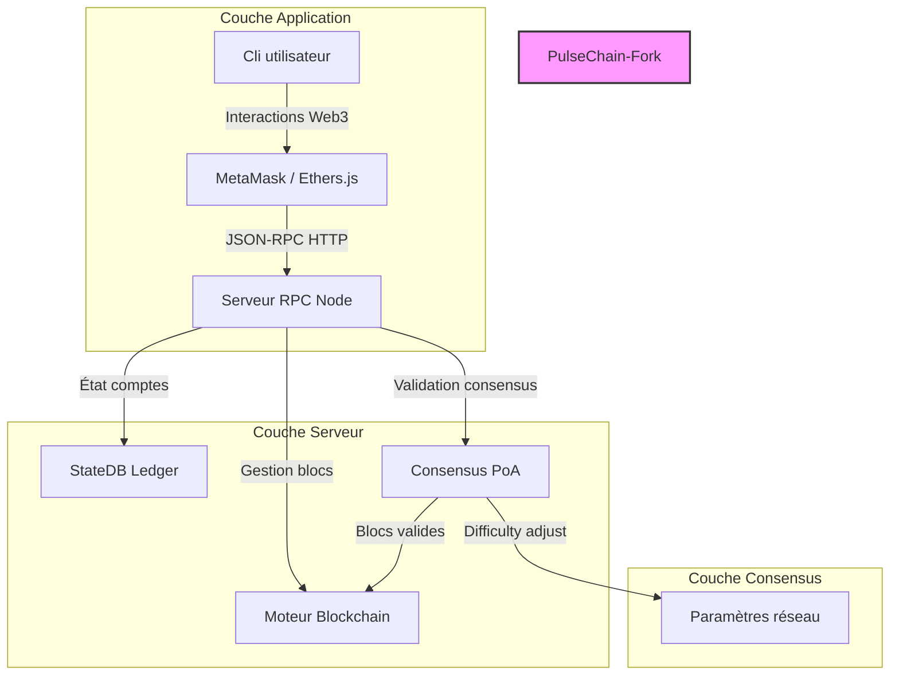
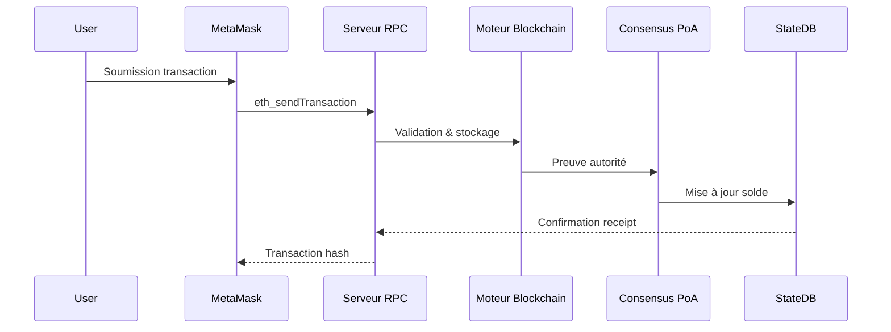
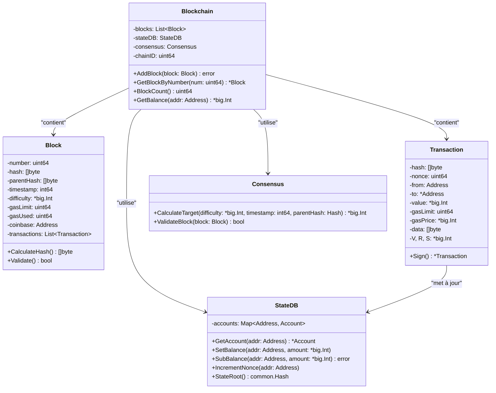
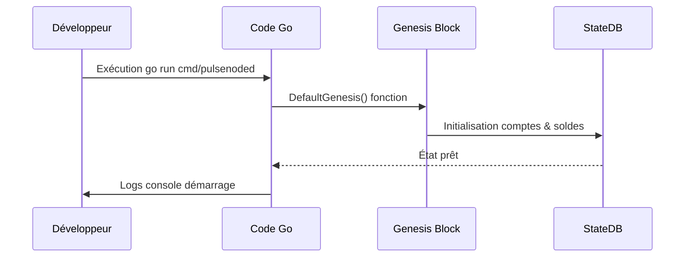
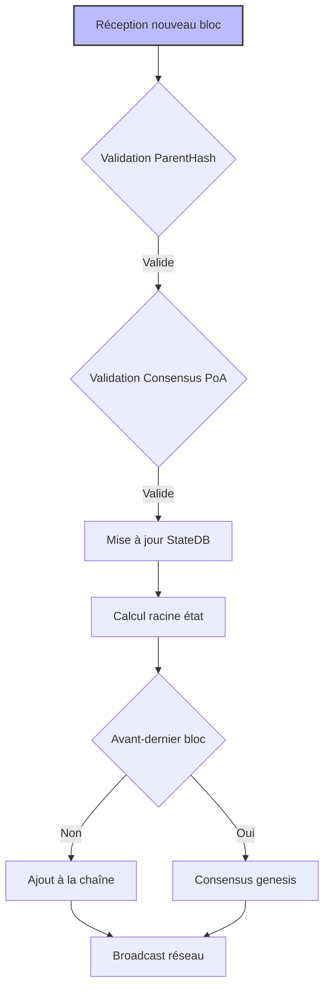

# PulseChain Fork - Wiki Project

> **Auteur :** Martial Zinsou  
> **Dépôt :** https://github.com/martialzinsou/pulsechain-fork  
> **Version :** 1.0.2  

## Bienvenue dans la documentation du projet PulseChain Fork

Ce wiki regroupe l'ensemble de la documentation technique, des captures d'écran, des schémas et des diagrammes UML du projet **PulseChain Fork**, une implémentation blockchain complète en langage Go.

### Sommaire

1. [Présentation du projet](#1-présentation-du-projet)
2. [Architecture Système](#2-architecture-système)
3. [Diagrammes UML](#3-diagrammes-uml)
4. [Captures d'écran](#4-captures-décran)
5. [API JSON-RPC](#5-api-json-rpc)
6. [Guide d'Utilisation](#6-guide-dutilisation)
7. [Déploiement](#7-déploiement)
8. [Licence](#8-licence)

---

## 1. Présentation du projet

**PulseChain Fork** est un fork complet de la blockchain PulseChain implémenté en Go. Ce projet fournit :

- Un moteur de blockchain complet
- Algorithme de consensus Proof-of-Authority (PoA)
- Serveur JSON-RPC 2.0 compatible Ethereum
- Gestion d'état (StateDB) des comptes
- Configuration du bloc génèse PulseChain (ChainID 369)
- Documentation exhaustive et scripts d'exploitation

**Auteur du projet :** [Martial Zinsou](https://github.com/martialzinsou)

---

## 2. Architecture Système

### Vue d'ensemble du système



### Flux de traitement des transactions



---

## 3. Diagrammes UML

### Diagramme de classes principal



### Diagramme de séquence - Initialisation du bloc Genesis



### Diagramme d'activité - Traitement d'un bloc



---

## 4. Captures d'écran

### Interface RPC JSON (port 8545)

#### Requête `eth_chainId`

```http
POST http://localhost:8545
Content-Type: application/json

{
  "jsonrpc": "2.0",
  "method": "eth_chainId",
  "params": [],
  "id": 1
}
```

**Capture d'écran attendue :** Fenêtre développeur navigateur affichant la réponse JSON `{"jsonrpc":"2.0","id":1,"result":"0x171"}` avec en évidence le résultat `0x171` (369 en décimal).

#### Requête `eth_blockNumber`

```http
POST http://localhost:8545
Content-Type: application/json

{
  "jsonrpc": "2.0",
  "method": "eth_blockNumber",
  "params": [],
  "id": 1
}
```

**Capture d'écran attendue :** Fenêtre développeur affichant la réponse JSON avec le numéro du dernier bloc miner.

#### Requête `eth_getBalance`

```http
POST http://localhost:8545
Content-Type: application/json

{
  "jsonrpc": "2.0",
  "method": "eth_getBalance",
  "params": ["0x2b5AD5c4795c026514f8317c7a215E218DcCD6cF", "latest"],
  "id": 1
}
```

**Capture d'écran attendue :** Solde du compte Genesis affiché en hexadécimal `0xd3c21bcecceda1000000`.

### Console de démarrage du nœud

#### Sortie attendue au lancement

```text
======================================================
     PULSECHAIN FORK NODE - MARTIAL ZINSOU            
======================================================
[+] Initialisation du bloc génèse PulseChain...
[+] ChainID: 369 | Coinbase: 0x2b5AD5c4795c026514f8317c7a215E218DcCD6cF
[+] Serveur JSON-RPC prêt à recevoir les connexions
[+] RPC Endpoint: http://localhost:8545 (compatible MetaMask/Ethers)
[+] Blocs initialisés: 1 (Bloc Genesis actif)
[+] Démarrage de l'écoute sur le port :8545 ...
```

### Interface MetaMask - Ajout du réseau

**Capture attendue :** 
- Onglet "Réseaux" de MetaMask
- Bouton "Ajouter un réseau"
- Champs remplis :
  - Nom : `PulseChain Fork (Martial Zinsou)`
  - RPC URL : `http://127.0.0.1:8545`
  - ID de chaîne : `369`
  - Symbole : `PLS`

---

## 5. API JSON-RPC

### Endpoints principaux

| Méthode | Description | Exemple |
|---------|-------------|---------|
| `eth_chainId` | ID réseau hexadécimal | `0x171` |
| `web3_clientVersion` | Version client | `PulseChain-Fork/v1.0.0-MartialZinsou/darwin-amd64/go1.21` |
| `eth_blockNumber` | Dernier bloc numéroté | `0x0` (Genesis) |
| `eth_getBalance` | Solde compte | `0xd3c21bcecceda1000000` |
| `eth_getBlockByNumber` | Données bloc | Objet JSON complet |
| `net_version` | ID réseau décimal | `369` |
| `eth_mining` | État minage | `false` |
| `eth_gasPrice` | Prix gaz | `0x3b9aca00` (1 Gwei) |

### Codes de réponse d'erreur

| Code | Message | Description |
|------|---------|-------------|
| `-32700` | Parse error | Payload JSON invalide |
| `-32600` | Invalid Request | Format JSON-RPC incorrect |
| `-32601` | Method not found | Méthode non implémentée |
| `-32602` | Invalid params | Paramètres invalides |
| `-32603` | Internal error | Erreur interne execution |

---

## 6. Guide d'Utilisation

### Installation rapide

```bash
# Clonage
git clone https://github.com/martialzinsou/pulsechain-fork.git
cd pulsechain-fork

# Installation dépendances
go mod tidy

# Compilation
go build -o pulsenoded ./pulsechain-fork/cmd/pulsenoded
```

### Démarrage du nœud

```bash
# Mode démon
./pulsenoded

# Ou mode développement
go run ./pulsechain-fork/cmd/pulsenoded
```

### Connexion avec MetaMask

1. Ouvrir MetaMask > Menu Réseaux > "Ajouter un réseau"
2. Remplir :
   - Nom réseau : `PulseChain Fork (Martial Zinsou)`
   - Nouvelle URL RPC : `http://127.0.0.1:8545`
   - ID de chaîne : `369` (ou `0x171`)
   - Symbole devise : `PLS`
3. Cliquer "Enregistrer"

---

## 7. Déploiement

### Avec Docker

```bash
# Construction de l'image
docker build -t pulsechain-fork .

# Lancement du conteneur
docker run -d -p 8545:8545 -p 30303:30303 --name pulse-node pulsechain-fork

# Vérification des logs
docker logs -f pulse-node
```

### Avec Docker Compose

```bash
docker compose up -d
docker compose logs -f
docker compose down
```

---

## 8. Licence

Ce projet est sous licence **MIT**. Voir le fichier `LICENSE` pour plus de détails.

**Auteur :** Martial Zinsou  
**GitHub :** https://github.com/martialzinsou/pulsechain-fork